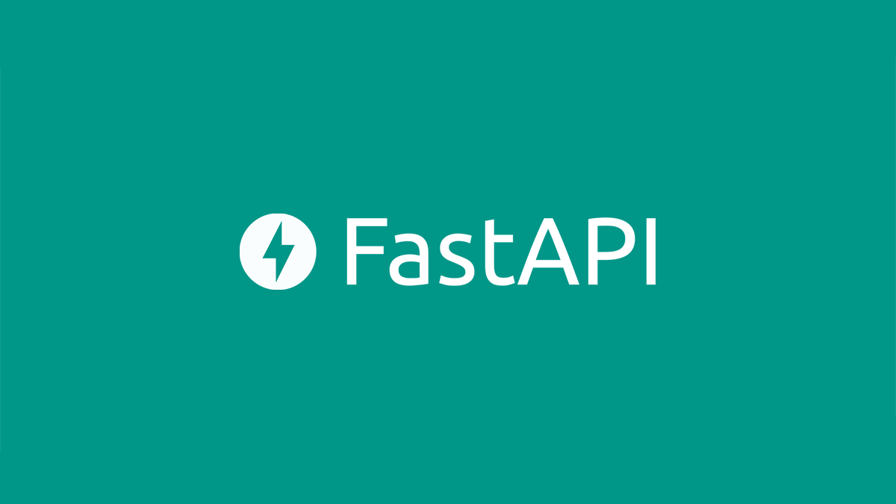

# :bookmark_tabs: Referral Service

## :pager: Стэк
- **Python**
- **FastAPI**
- **Postgresql**
- **SQLAlchemy**

### Тестовое задание для Python Backend Разработчика

Нажмите, чтобы посмотреть подробности

### Описание:
 Необходимо разработать простой RESTful API сервис для реферальной системы.
### Функциональные требования:
- Регистрация и аутентификация пользователя (JWT, Oauth 2.0);
- Аутентифицированный пользователь должен иметь возможность создать или удалить свой реферальный код. Одновременно может быть активен только 1 код. При создании кода обязательно должен быть задан его срок годности;
- Возможность получения реферального кода по email адресу реферера;
возможность регистрации по реферальному коду в качестве реферала;	
получение информации о рефералах по id реферера;
UI документация (Swagger/ReDoc)
### Опциональные задачи:
- Использование clearbit.com/platform/enrichment для получения дополнительной информации о пользователе при регистрации;
- Использование emailhunter.co для проверки указанного email адреса;
- Кеширование реферальных кодов с использованием in-memory БД. 
- Readme.md файл с описанием проекта и инструкциями по запуску и тестированию

### Требования к проекту:
- чистота и читаемость кода
- все I/O bound операции должны быть асинхронными;
- проект должен быть хорошо структурирован.
- проект должен быть простым в деплое, обеспечивать - обработку нестандартных ситуаций, быть устойчивой к неправильным действиям пользователя и т.д.

## Установка

### 0) Установить константы в .env-non-dev (для работы email) 
    EMAIL_SENDER - адрес электронной почты с которого будет отправляться сообщение
    EMAIL_PASSWORD - пароль (в двухэтапной аутентификации аккаунта, создать пароли приложений) 
### 1) Из директории (referral_service_main), где расположен файл Dockerfile, выполните команду 
    docker-compose up --build

### 2) Перейти по адресу
     http://127.0.0.1:8000/docs

<!-- 

    

<h2 align="center">Digital Resume</h2>

[Сайт](http://olegremizoff.pythonanywhere.com/)

Blog на Flask 2.2.2 -->
